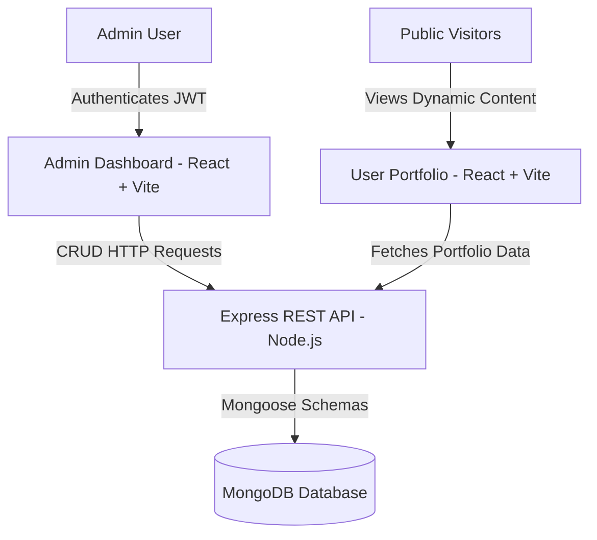

# Portfolio Management System

> A full-stack, production-grade personal portfolio platform and administrative content management dashboard built with React 19, Vite 6, Node.js, Express 5, and MongoDB.

The **Portfolio Management System** is a full-stack platform designed to manage and display professional engineering credentials, projects, work experience, education, skills, coding profiles, and verified certifications. It features a public-facing User Portfolio website and a secure Admin Control Panel for real-time portfolio administration without code modifications.

---

## 🌐 Live Production Deployments

| Component | Hosting Platform | Live URL |
| :--- | :--- | :--- |
| **User Portfolio (Public Website)** | Cloudflare Pages | [https://prasanna.pages.dev](https://prasanna.pages.dev) |
| **Admin Dashboard (Control Panel)** | Cloudflare Pages | [https://admin-prasanna.pages.dev](https://admin-prasanna.pages.dev) |
| **Backend REST API Server** | Render | [https://prasanna-dev-api.onrender.com](https://prasanna-dev-api.onrender.com) |

---

## Overview

The platform operates as a cohesive multi-tier system with an administrative dashboard, a shared REST API server, a MongoDB database, and a public portfolio application:



### System Architecture Workflow
1. **Content Administration**: The administrator logs into the **Admin Dashboard** via JWT authentication. The admin manages portfolio sections (Personal Info, Skills, Projects, Work Experience, Education, Certifications, and Coding Profiles), sets visibility toggles, adjusts display priorities, and uploads files.
2. **Backend Engine**: An Express.js REST API handles validation, password hashing (`bcryptjs`), session verification (`jsonwebtoken`), base64 file processing, and MongoDB database interactions via Mongoose schemas.
3. **Public Delivery**: The **User Portfolio** dynamically fetches active portfolio records from the API. Content updates made in the Admin Dashboard reflect immediately on the public website without redeploying the application.

---

## Features

### User Portfolio (Public Website)
- **Dynamic Data Engine**: All section data (projects, experiences, skills, education, certifications, and profiles) is dynamically fetched from the database. Zero static or hardcoded dummy content.
- **Hero & Personal Branding**: Displays personal bio, title, location, avatar, email, social links, and an embedded resume download trigger.
- **Categorized Technical Skills**: Renders skills grouped by domain alongside a dedicated **Coding Profiles** subsection featuring external links to LeetCode, HackerRank, CodeChef, Codeforces, GitHub, and LinkedIn.
- **Featured Projects & Expandable Showcase**:
  - Top 3 featured project cards with image previews, descriptions, technology badges, GitHub repository links, and live demo URLs.
  - Expandable **"+ More Projects"** carousel with interactive modal detail views.
- **Horizontal Career Timeline**: Renders work experience history chronologically as a horizontal timeline with role titles, company names, employment dates, locations, descriptions, and technology chips.
- **Academic Qualifications**: Displays educational degrees, institutions, study periods, GPA/percentages, and career objectives.
- **Aspect-Ratio Preserving Certifications Carousel**:
  - Displays verified credentials in a horizontal carousel preserving exact image/PDF natural aspect ratios with zero cropping and zero distortion.
  - PDF preview renderer with page-1 preview embeds and `[ View PDF ↗ ]` overlay triggers.
  - Dynamic zero-padded position indicator (e.g. `01 / 05`, `02 / 05`) following database display order.
- **Interactive Contact Form**: Integrated client-side contact form with EmailJS browser integration, direct email link, and social profiles.
- **Responsive Viewport Navigation**: Fixed header navbar with dynamic height calculation (`scrollToSection`) ensuring smooth, offset-aligned scrolling below the sticky navbar.

### Admin Dashboard (Control Panel)
- **Secure JWT Authentication**: Protected dashboard routes utilizing JWT tokens, password hashing with `bcryptjs`, and automated session expiration checks.
- **Personal Details & Resume Management**: Update personal info, biography, contact information, profile avatar URL, and PDF resume documents.
- **Project Management**: Create, edit, delete, toggle visibility, assign featured status, and set display order priorities for portfolio projects.
- **Skills Management**: Group technical skills into custom categories with icons and display order fields.
- **Experience Management**: Manage career roles, organization names, start/end dates, location, bullet descriptions, and technology arrays.
- **Certifications Management**: Add credentials with instant file upload preview (PNG, JPG, SVG, or PDF up to 5MB), verification URLs, credential IDs, and display order priority integers.
- **Coding Profiles Management**: Link competitive programming profiles with platform handles, icons, and display ordering.
- **Visibility & Display Priority Control**: Every portfolio section supports instantaneous active/hidden toggling and numerical ordering (`displayOrder`).

---

## Tech Stack

### Frontend (User Portfolio & Admin Client)
- **Framework**: React 19 (`19.2.3`), React DOM 19
- **Build Tool**: Vite 6 (`6.0.7`), `@vitejs/plugin-react`
- **Styling**: Vanilla CSS3, CSS Variables, Fluid Typography (`clamp`), Material Symbols, Bootstrap 5 (`5.3.8`)
- **HTTP Client**: Axios (`1.13.2`)
- **Authentication Handling**: JS-Cookie (`3.0.8`)
- **Email Service**: EmailJS Browser (`4.4.1`)

### Backend API Server
- **Runtime**: Node.js (`v18+` / `v20+`)
- **Framework**: Express.js 5 (`5.2.1`)
- **Database ODM**: Mongoose 9 (`9.1.2`)
- **Security & Auth**: BcryptJS (`3.0.3`), JSONWebToken (`9.0.3`), CORS (`2.8.5`)
- **Environment Management**: Dotenv (`17.2.3`)
- **Development Tooling**: Nodemon (`3.1.11`)

### Database & Storage
- **Database**: MongoDB (Local instance or MongoDB Atlas)
- **File Storage**: Base64 data URLs / static asset serving embedded in Mongoose documents.

---

## Repository Structure

```text
Portfolio/
├── user/                             # Public User Portfolio Website (React 19 + Vite 6)
│   ├── index.html                    # Vite entry HTML
│   ├── vite.config.js                # Vite dev server configuration (Port 3000)
│   ├── src/
│   │   ├── components/               # Header, Hero, Skills, Projects, Experience, Education, Certifications, Contact, Footer
│   │   ├── utils/                    # Scroll helpers and utility functions
│   │   ├── App.js                    # Main User Application & API data state manager
│   │   └── index.css                 # Global CSS design tokens
│   └── package.json
│
├── admin/                            # Administrative Control System
│   ├── client/                       # Admin Frontend Dashboard (React 19 + Vite 6)
│   │   ├── index.html                # Vite entry HTML
│   │   ├── vite.config.js            # Vite dev server configuration (Port 3001)
│   │   ├── src/
│   │   │   ├── components/           # Login, Dashboard, PersonalSection, EducationSection, SkillsSection, ProjectsSection, ExperienceSection, CertificationsSection, ProfilesSection
│   │   │   └── App.js                # Main Admin Router & Auth Guard
│   │   └── package.json
│   │
│   └── server/                       # Backend Express REST API
│       ├── Models/                   # Mongoose Database Schemas
│       │   ├── admin.js              # Admin authentication credentials
│       │   ├── personalDetails.js    # Personal biography & social details
│       │   ├── skillGroup.js         # Categorized skills
│       │   ├── projectDetails.js     # Portfolio projects
│       │   ├── experience.js         # Work experience history
│       │   ├── educationalDetails.js # Academic history & objectives
│       │   ├── certification.js      # Verified certifications & file previews
│       │   ├── codingProfile.js      # Competitive programming profiles
│       │   └── resume.js             # Resume file document
│       ├── index.js                  # Express API server entrypoint (Port 3002)
│       └── package.json
│
├── package.json                      # Unified root scripts for monorepo operations
└── README.md                         # Project documentation
```

---

## Database Models

| Model | Collection | Primary Fields |
| :--- | :--- | :--- |
| `Admin` | `admins` | `email`, `password` (bcrypt hash) |
| `PersonalDetails` | `personaldetails` | `name`, `title`, `bio`, `email`, `location`, `avatarUrl`, `socialLinks` |
| `SkillGroup` | `skillgroups` | `category`, `skills` (`name`, `icon`), `displayOrder`, `isVisible` |
| `ProjectDetails` | `projectdetails` | `title`, `description`, `techList`, `codeUrl`, `demoUrl`, `imageUrl`, `isFeatured`, `displayOrder`, `isVisible` |
| `Experience` | `experiences` | `title`, `company`, `startDate`, `endDate`, `period`, `location`, `description`, `technologiesUsed`, `displayOrder`, `isVisible` |
| `EducationalDetails` | `educationaldetails` | `academic` (`degree`, `institution`, `period`, `gpa`, `description`), `coreObjective`, `isVisible` |
| `Certification` | `certifications` | `title`, `issuingOrganization`, `issueDate`, `credentialId`, `verificationUrl`, `certificateFileUrl`, `displayOrder`, `isVisible` |
| `CodingProfile` | `codingprofiles` | `platform`, `profileUrl`, `handle`, `icon`, `displayOrder`, `isVisible` |
| `Resume` | `resumes` | `resumeUrl`, `fileData`, `filename`, `mimeType` |

---

## API Endpoints Reference

### Public API Routes
- `GET /api/user` — Fetch personal biography and contact info.
- `GET /api/skills` — Fetch active technical skill categories.
- `GET /api/skill-groups` — Alias for skill groups.
- `GET /api/projects` — Fetch active projects ordered by `displayOrder`.
- `GET /api/experiences` — Fetch active work experiences.
- `GET /api/education` — Fetch educational details and core objective.
- `GET /api/certifications` — Fetch active certifications ordered by `displayOrder`.
- `GET /api/profiles` — Fetch active coding profiles.
- `GET /api/resume` — Download/view active resume document.

### Admin Authentication & Management Routes
- `POST /api/admin/login` — Authenticate admin credentials and generate JWT token.
- `GET /api/admin/verify` — Validate active JWT authentication session.
- `POST /api/admin/logout` — Terminate admin session.
- `POST / PUT /api/user` — Update personal biography details.
- `POST / PUT /api/projects/save` — Save/update project record.
- `DELETE /api/projects/:id` — Delete project record.
- `PATCH /api/projects/:id/status` — Toggle project visibility.
- `POST / PUT /api/experiences/save` — Save/update work experience record.
- `DELETE /api/experiences/:id` — Delete work experience record.
- `POST / PUT /api/certifications/save` — Save/update certification record with file upload.
- `DELETE /api/certifications/:id` — Delete certification record.
- `PATCH /api/certifications/:id/status` — Toggle certification visibility.
- `POST / PUT /api/education/save` — Save/update education details.
- `POST / PUT /api/profiles/save` — Save/update coding profile record.

---

## Environment Variables

### Backend Server (`admin/server/.env`)

Create a `.env` file in `admin/server/`:

```env
PORT=3002
MONGO_URI=mongodb://127.0.0.1:27017/portfolio
JWT_SECRET=your_secure_jwt_secret_key_here
ADMIN_EMAIL=admin@portfolio.com
ADMIN_PASSWORD=adminPassword123
```

### Frontend Applications (`user/.env` & `admin/client/.env`)

```env
VITE_API_BASE_URL=http://localhost:3002/api
```

---

## Installation & Local Setup

### 1. Clone Repository & Install Dependencies

```bash
# Clone the repository
git clone https://github.com/Prasanna-Anjaneyulu078/Portfolio.git
cd Portfolio

# Install dependencies for User Frontend
cd user
npm install

# Install dependencies for Admin Frontend
cd ../admin/client
npm install

# Install dependencies for Backend Server
cd ../server
npm install
```

### 2. Configure Database & Environment

Ensure MongoDB is running locally or provide a valid MongoDB Atlas connection string in `admin/server/.env`.

### 3. Run Applications in Development Mode

From the repository root (`Portfolio/`):

```bash
# Start Backend API Server (Port 3002)
npm run server

# Start Public User Website (Port 3000)
npm run user

# Start Admin Dashboard Client (Port 3001)
npm run admin
```

---

## Build & Production Deployment

To build optimized production assets:

```bash
# Build User Public Website (outputs to user/dist/)
npm run user:build

# Preview User Website Build
npm run user:preview

# Build Admin Dashboard Client (outputs to admin/client/dist/)
npm run admin:build

# Preview Admin Dashboard Build
npm run admin:preview
```

---

## License

This repository is maintained as an open-source personal portfolio platform.
